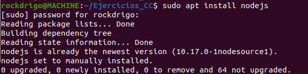
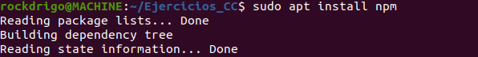
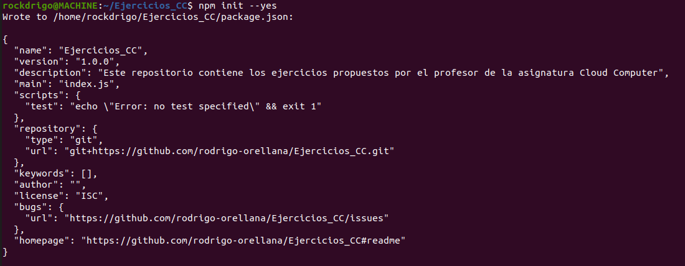
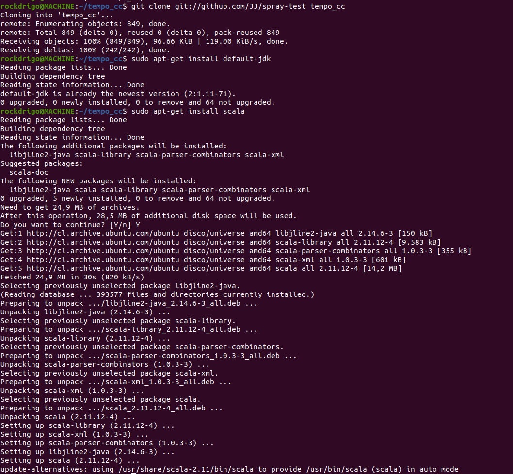

## Entornos Virtuales  

**Ejercicio 1**  
Instalar alguno de los entornos virtuales de node.js (o de cualquier otro lenguaje con el que se esté familiarizado) y, con ellos, instalar la última versión existente, la versión minor más actual de la 4.x y lo mismo para la 0.11 o alguna impar (de desarrollo).  
  

Una vez ejecutado el comando anterior, ejecutamos el siguiente comando para instalar npm, el administrador de paquetes de nodejs.
  

**Ejercicio 2**  
Crear una descripción del módulo usando package.json. En caso de que se trate de otro lenguaje, usar el método correspondiente.  
Con el siguiente comando creamos un package.json por defecto  
  

**Ejercicio 3**  
Descargar el repositorio de ejemplo anterior, instalar las herramientas necesarias (principalmente Scala y sbt) y ejecutar el ejemplo desde sbt. Alternativamente, buscar otros marcos para REST en Scala tales como Finatra o Scalatra y probar los ejemplos que se incluyan en el repositorio.  
  

