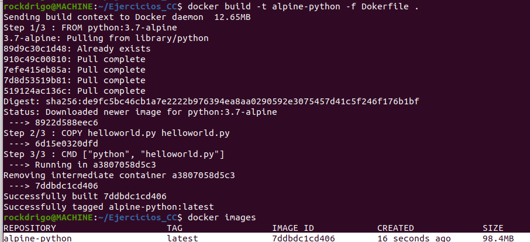
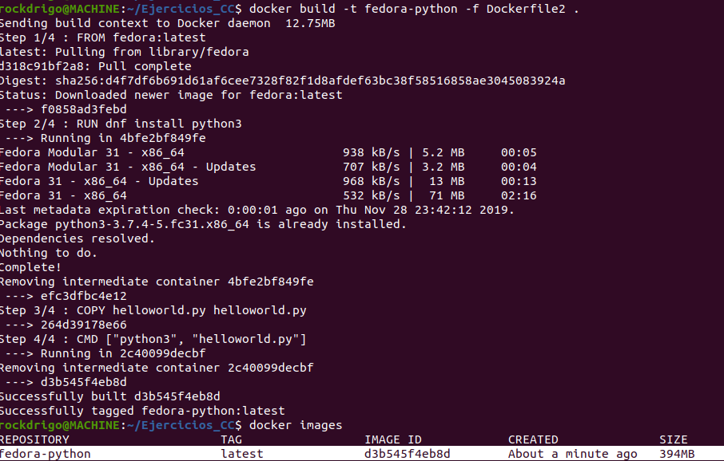

## Docker  
Ejercicio.- crear un programa simple, “Hola mundo” y comparar el tamaño de las imágenes de diferentes sistemas operativos base, Fedora, CentOS y Alpine, por ejemplo.  
Creamos el script python holamundo.py
  

* alpine
~~~
FROM python:3.7-alpine
COPY helloworld.py helloworld.py
CMD ["python", "helloworld.py"]
~~~
  

* Fedora
~~~
FROM fedora:latest
RUN dnf install python3
COPY helloworld.py helloworld.py
CMD ["python3", "helloworld.py"]
~~~
  

Conclusion: Los tamaños de imagenes resultantes varian mucho respecto a su imagen origen. En las pruebas la imagen de Fedora tiene un tamaño de a Alpine.