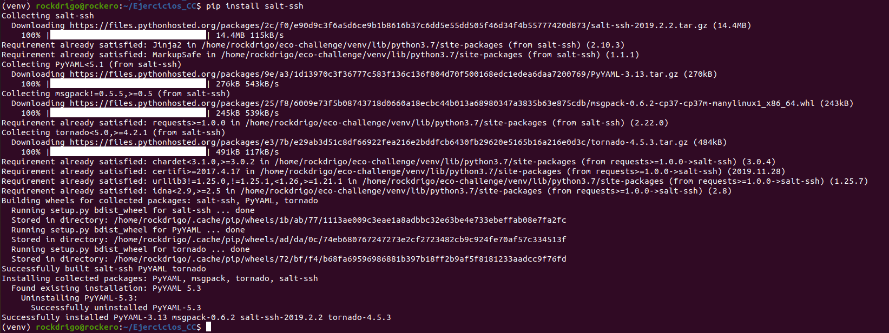
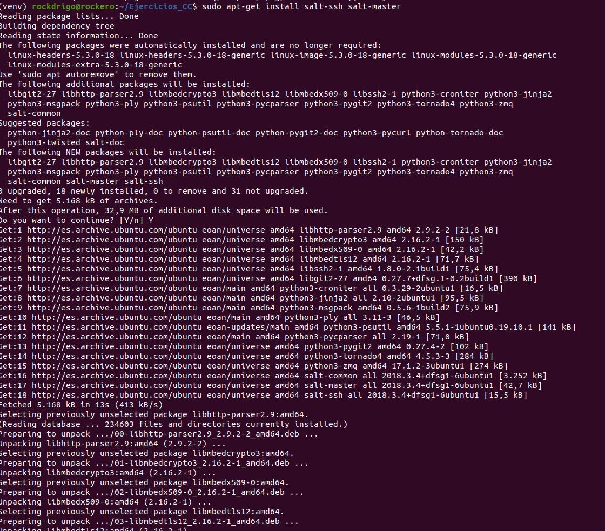
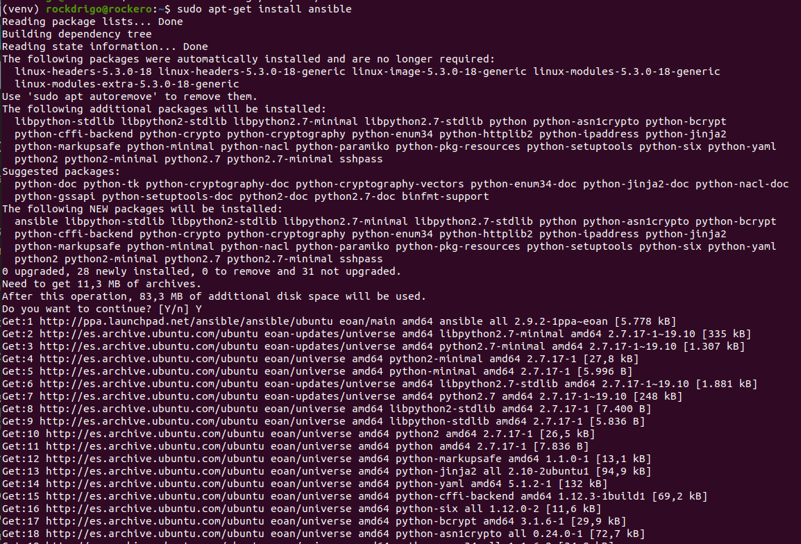
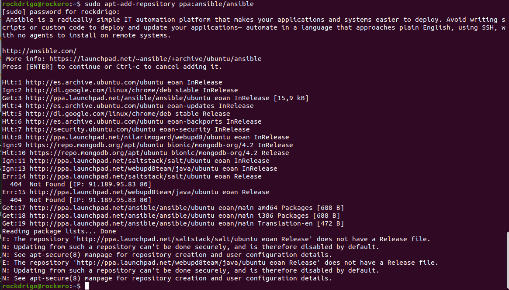

## PROVISIÓN  

**SALT-SSH**  
~~~
sudo add-apt-repository ppa:saltstack/salt
sudo apt-get install salt-ssh salt-master
pip install salt-ssh

cp -r /etc/salt/ /home/rockdrigo/lib/salt/
~~~
  

  

**Ejercicio1.-** Provisionar una máquina virtual en algún entorno con los que trabajemos habitualmente (incluyendo el programa que se haya realizado para los hitos anteriores) usando Salt:  

~~~
sudo apt-add-repository ppa:ansible/ansible
sudo apt-get install ansible
~~~  

  
  

~~~  
[defaults]
host_key_checking = False
inventory = ./ansible_hosts
~~~  

~~~  
echo "ansible-iv.cloudapp.net" > ~/ansible_hosts
export ANSIBLE_HOSTS=~/ansible_hosts
ansible all -u jjmerelo -m ping
~~~  
[ansible.cfg](https://github.com/rodrigo-orellana/Ejercicios_CC/blob/master/provision/ansible.cfg)  
[ansible_hosts](https://github.com/rodrigo-orellana/Ejercicios_CC/blob/master/provision/ansible_hosts)  

**Ejercicio2.-** Desplegar la aplicación de cualquier otra asignatura donde se tenga ya el código fuente con todos los módulos necesarios usando un playbook de Ansible.  
~~~  
---
- hosts: vagrantboxes
  become: yes
  tasks:
    - name: Instala paquetes
      apt:
        pkg: ['curl', 'build-essential', 'libssl-dev', 'nodejs', 'npm']
~~~  

**Ejercicio3.-** Crear un rol common que haga ciertas tareas comunes que vayamos a usar en todas las máquinas virtuales de los microservicios de la asignatura (o, para el caso, cualquier otra asignatura).

