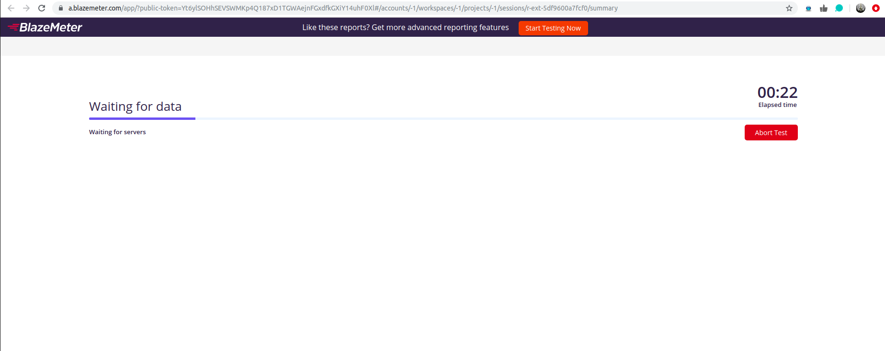

## TAURUS  
Ejercicio.- Medir prestaciones iniciales del microservicio contruido en el proyecto de CC  
Medición de prestaciones en localhost antes de realizar ajustes, para probar correcta instalación de Taurus.  
Archivo de configuración:
~~~
execution:
- concurrency: 3
  ramp-up: 10s
  hold-for: 50s
  scenario: quick-test

scenarios:
  quick-test:
   requests:
   - http://localhost:8000/

~~~  
Ejecución:  
  
  
